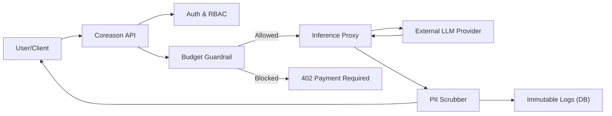

# Architecture

## The Philosophy (The Why)

In the high-stakes environment of biopharmaceutical development, we face a critical tension: the need for rapid AI innovation versus the absolute requirement for GxP compliance, data sovereignty, and auditability. The standard approach—allowing developers direct access to model APIs—creates a "Black Box" liability where costs spiral and decision provenance is lost.

We architected the **coreason_adlc_api** to resolve this by shifting governance from a client-side "honor system" to a server-side "hard gate." Our intent is to prevent "Toxic Telemetry" and "Cloud Bill Shock" while ensuring that every AI-generated insight is inextricably linked to a human identity. This middleware acts as a "Clean Room" airlock, securing the data plane without hindering developer velocity.

## Under the Hood (The Dependencies & Logic)

The architecture leverages a stack chosen for concurrency, security, and integration rather than raw generative capability:

*   **fastapi & uvicorn**: The backbone is asynchronous, designed to handle high-concurrency inference requests without blocking the application logic.
*   **litellm**: This dependency underscores our "Borrow to Build" mandate. Instead of writing custom clients for every model provider, we use litellm as a universal proxy, allowing the middleware to intercept payloads regardless of the underlying model.
*   **presidio-analyzer & spacy**: These libraries provide the "scrubbing" intelligence. By integrating Microsoft’s Presidio directly into the memory stream, we ensure that PII detection happens locally and in-memory, intercepting sensitive data before it ever touches a disk. *Note: PII scrubbing requires Python < 3.14.*
*   **redis & asyncpg**: Performance is critical. redis handles high-speed, atomic budget counting, while asyncpg ensures non-blocking writes to the immutable PostgreSQL audit logs.
*   **cryptography**: Security is treated as a first-class citizen with AES encryption primitives, enabling a "Vault" architecture where API keys are decrypted only in memory during inference.

### Data Flow

The internal logic operates as a series of **Interceptors**.

1.  **Request Arrival**: When a request arrives, it is authenticated via OIDC.
2.  **Budget Gatekeeper**: Checks if the user has sufficient budget. This is an atomic Redis operation.
3.  **Inference Proxy**: The request is forwarded to the LLM via `litellm`.
4.  **PII Sentinel**: The response is scrubbed for PII *before* logging.
5.  **Logging**: The sanitized payload is written to the immutable audit log.

### Component Diagram



## In Practice (Examples)

The utility of coreason_adlc_api is best understood through its enforcement mechanisms.

### The Budget Guardrail

Before any inference occurs, the system performs an atomic check against a user's daily limit. This prevents infinite loops or excessive testing from draining resources.

```python
# Conceptual Flow
try:
    # Atomic check backed by Redis
    check_budget_guardrail(user_id, estimated_cost)
except BudgetExceededError:
    # 402 Payment Required is raised to the client
    pass
```

### In-Stream PII Scrubbing

To prevent "Toxic Telemetry," the API scrubs payloads in memory using a Singleton analyzer.

```python
# Raw: "Patient John Doe called from 555-0199..."
# Scrubbed: "Patient <REDACTED PERSON> called from <REDACTED PHONE_NUMBER>..."
```
