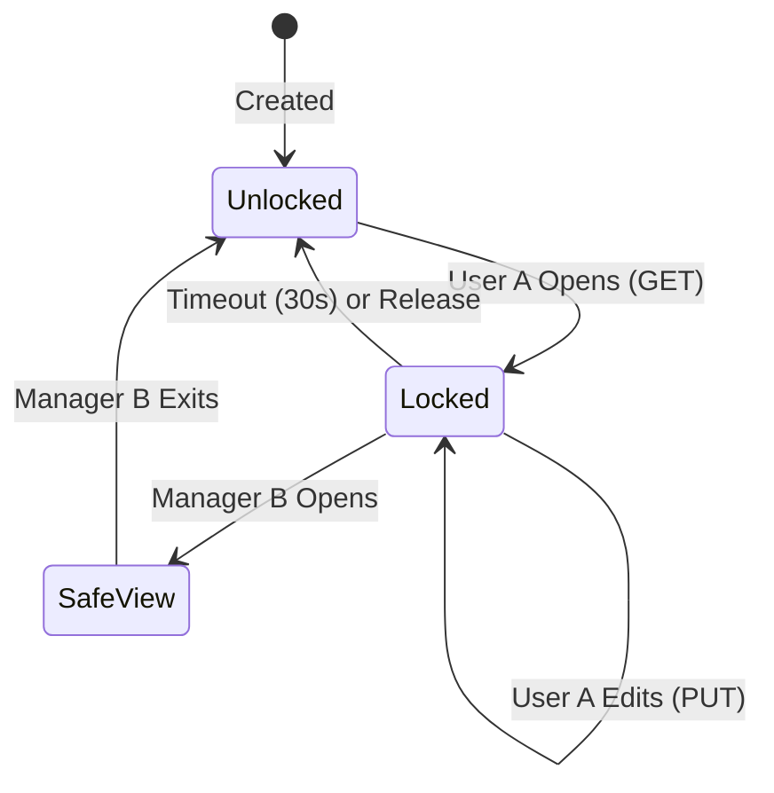

# Workflow & Lifecycle Guide

This guide explains the complex workflows implemented in the Coreason Workbench, specifically the **Pessimistic Locking** mechanism and the **Manager Safe View**.

## 1. The Draft Lifecycle

An "Agent Draft" represents a work-in-progress AI agent. To prevent conflicts (two developers overwriting each other), we enforce a strict state machine.



### States

1.  **Unlocked**: No one is editing. Available for anyone with Project Access.
2.  **Locked (Edit Mode)**:
    *   **Trigger**: A user calls `GET /drafts/{id}`.
    *   **Effect**: The `locked_by_user` field is set to their UUID.
    *   **Expiry**: The lock auto-expires after 30 seconds if not refreshed (Heartbeat).
    *   **Permission**: Only the lock holder can `PUT` updates.
3.  **Safe View (Read-Only)**:
    *   **Trigger**: A Manager tries to access a draft locked by someone else.
    *   **Effect**: The Manager sees the content but cannot edit.
    *   **Purpose**: Allows code review/help without breaking the developer's session.

## 2. Pessimistic Locking Implementation

The locking is "Pessimistic" because we assume conflict is likely.

### Acquiring the Lock
When you fetch a draft:
```http
GET /api/v1/workbench/drafts/{id}
```
The server checks:
*   Is it locked?
*   If **No**: Lock it for you. Return `mode: "EDIT"`.
*   If **Yes (By You)**: Refresh lock. Return `mode: "EDIT"`.
*   If **Yes (By Other)**:
    *   Are you a **Manager**? -> Return `mode: "SAFE_VIEW"` (200 OK).
    *   Are you a **Developer**? -> Return `423 Locked` Error.

### Maintaining the Lock (Heartbeat)
The frontend must send a heartbeat every 10-20 seconds to prevent the lock from expiring.

```http
POST /api/v1/workbench/drafts/{id}/lock
```

### Releasing the Lock
Locks are released automatically by timeout or explicitly (if implemented). The 30-second timeout is a "Dead Man's Switch" to prevent permanently locked files if a browser crashes.

## 3. Manager Override ("Safe View")

The "Safe View" is a critical compliance feature. It ensures that a Manager can inspect code (e.g., during a screenshare or audit) without the risk of accidentally modifying it or "stealing" the write lock from the active developer.

**Client-Side Behavior in Safe View:**
*   **Disable**: "Save" button.
*   **Disable**: "Run/Execute" button (to prevent triggering costs/side-effects).
*   **Show**: A banner "Viewing in Read-Only Mode (Locked by {User})".
